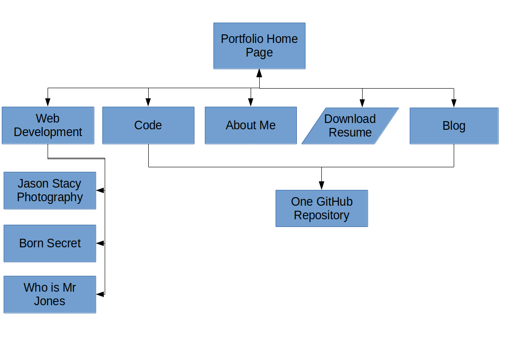
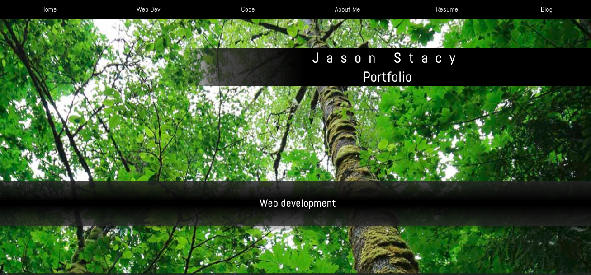
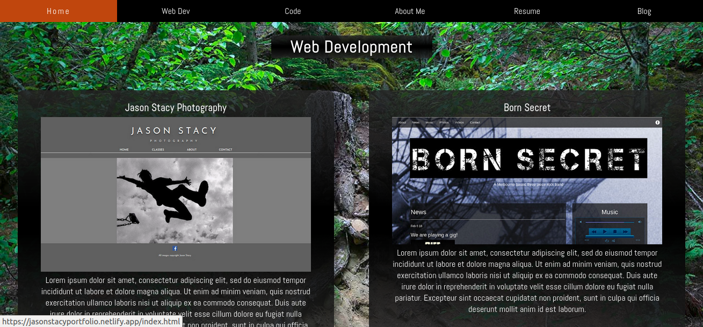
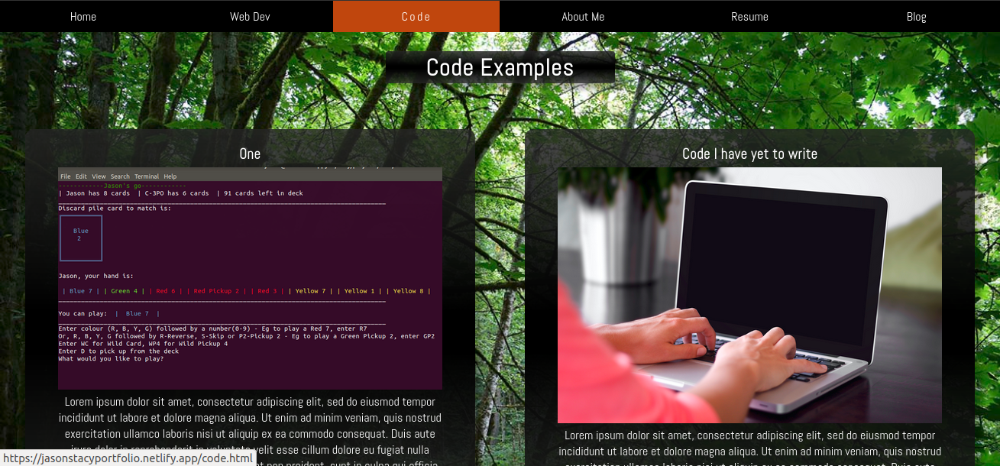
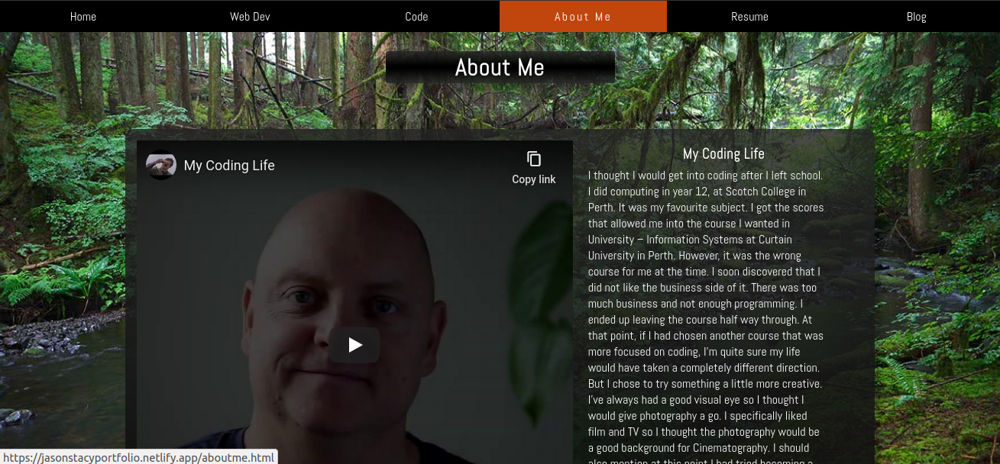
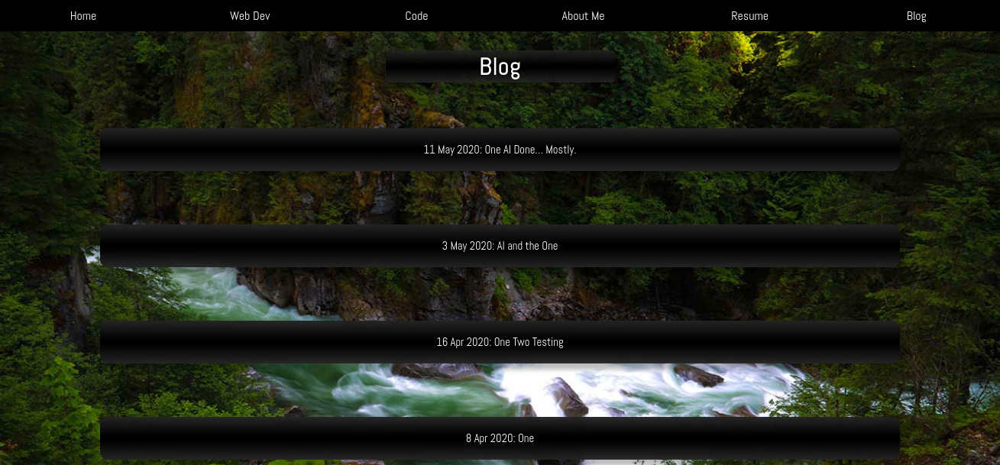

# Jason Stacy Portfolio Website

### Links

[Website](https://jasonstacyportfolio.netlify.app/index.html)

[GitHub Repository](https://github.com/drumovski/portfolio)

### Purpose

This website is a showcase of my development work, details about me and my contact details and resume. It is something I can show potential employers to demonstrate my skills as a Web Developer, Coder and other skills.

### Functionality / features

The site has 5 separate pages and they are all linked together through a navigation bar. The navigation bar is included throughout all pages. The nav bar also is responsive and shrinks to a hamburger menu for mobile devices.

The pages are:

1. **Home**
2. **Web Development**
3. **Code**
4. **About Me**
5. **Blog**

All sites are thematically linked with similar forest scene background images from my photography work. I used a parallax effect in all pages to have the background image static with scroll-able foreground content. The exception to this is the home page which has an additional effect to make the background scroll at a slower rate than the foreground.

All content is responsive for different width screens. There is two media queries. One for mobile to active the hamburger menu and one for screens larger than 900px to split some content over 2 columns. I felt that this was sufficient as the content is mostly percentage based and scales with the screen width consistently with the design vision I had for the pages.

The blog page has drop-down content included within the page to display the blog post contents.

The resume links to a PDF file to download.

### Sitemap

### Screenshots

### Target audience

The target audience for this portfolio are potential employers and Code Academy staff and students.

### Tech stack (e.g. html, css, deployment platform, etc)

I have used:

- **HTML**
- **SCSS / CSS** 
- **Javascript (Only for drop-down effect in blog-page)**
- **GitHub (Repository will all files)**
- **Netlify (Hosting platform from GitHub repository)**